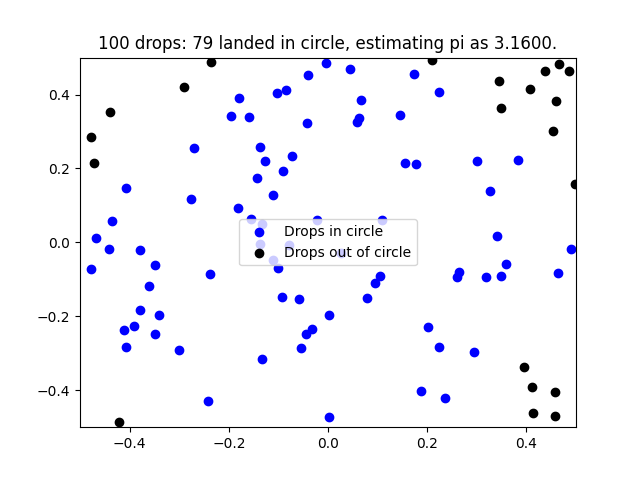
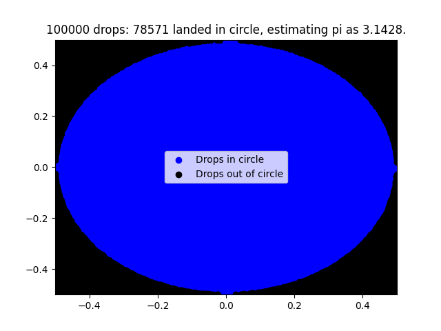

# Estimating π using monte carlo

Watched a youtube recomended video about monte carlo, previously i only knew about it in definations, but never in application, the video link is -  

 
After watching the video, I wanted to understand how actually to implement it. 

**Results** - The images show how the grid would look if 100 drops were randomly droped on it, *blue* shows the inside circle region and *black* shows points/drops otherwise. 

After 100 drops -  

 
This returns : 

    ----------------------
    100 drops
    pi estimated as:
            3.08
    ----------------------

After 100000 drops -  

 
This returns : 

    ----------------------
    100000 drops
    pi estimated as:
            3.14284
    ----------------------
